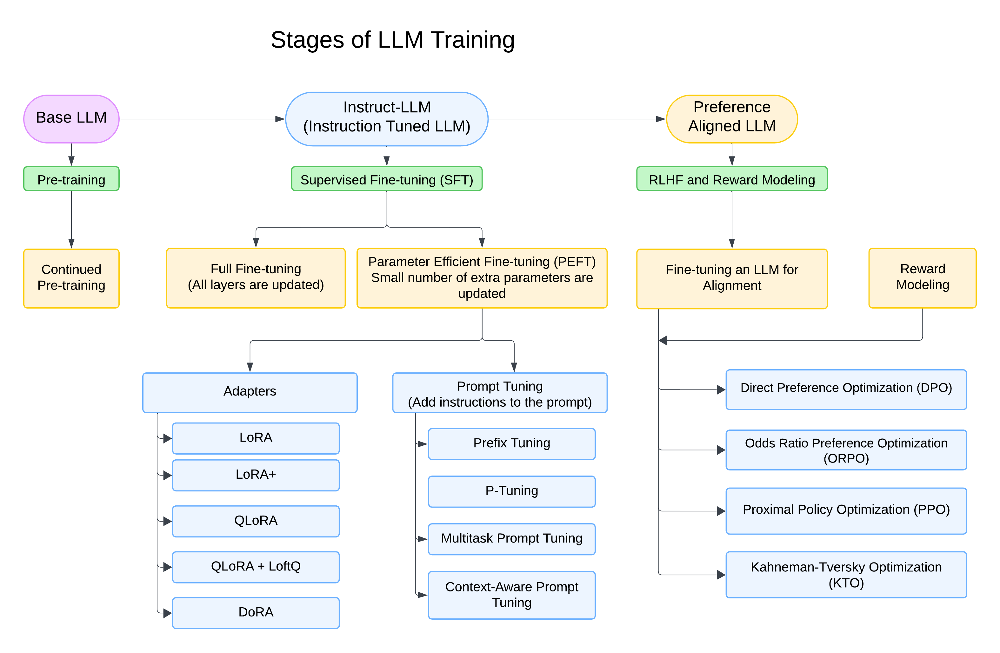

# LLM Finetuning

<br>


- Supervised Fine-Tuning (SFT) and Reinforcement Learning from Human Feedback (RLHF) are two fundamental processes for enhancing the capabilities of Language Models (LMs) post pre-training, aligning them better with human preferences.

- The current common practice in NLP is to fine-tune large pre-trained language models (LLM) for downstream tasks. The standard approach for fine-tuning is supervised fine-tuning (SFT), which trains the model on demonstrations of solving the task using supervised learning.
- When it is easier to evaluate or rank model outputs than it is to gather
demonstrations that accurately perform the desired task, an alternative method called reinforcement
learning from human feedback (RLHF)  can be used.
- RLHF builds on the SFT model, introducing a reward model trained on human-labeled rankings to capture nuanced preferences. Using reinforcement learning techniques like Proximal Policy Optimization (PPO), the SFT model is further refined to maximize alignment with these human-derived reward signals. While SFT ensures the model adheres to task-specific requirements, RLHF refines this alignment to better match subjective human preferences, resulting in a model that is both functional and intuitively responsive.

## SFT

- Supervised Fine-Tuning (SFT) is the process of refining a pre-trained LLM using labeled data to align it with specific tasks or desired behaviors.
- In this approach, the model learns to map inputs to desired outputs by minimizing a supervised loss function, typically cross-entropy.
- The training data often consists of human-labeled examples, such as prompts paired with preferred responses. It is particularly useful for aligning general-purpose models with domain-specific requirements or enhancing performance on well-defined tasks.
- P-tuning is a technique for fine-tuning large pre-trained models by optimizing a set of learnable prompt embeddings instead of updating the entire model’s parameters. It involves prepending task-specific, trainable prompt tokens to the input, which guides the model to generate desired outputs.
- P-tuning is effective for adapting models to new tasks without requiring extensive retraining. It allows for faster, resource-efficient fine-tuning with minimal adjustments to the pre-trained model.
- Prefix Tuning is a method for adapting pre-trained models to specific tasks by optimizing a set of fixed-length trainable prefix tokens added to the input sequence, without modifying the model's original parameters.
- These prefix tokens, which are learned during training, steer the model's behavior and help it generate task-specific outputs. Like P-tuning, prefix tuning focuses on parameter efficiency, as it only adjusts the learned prefixes rather than the entire model.
- It is particularly effective for large language models, offering a scalable and resource-efficient alternative to full fine-tuning. Prefix tuning allows for task-specific adaptation while preserving the core capabilities of the pre-trained model.
- Prompt Tuning is a method for adapt
- ing pre-trained models by optimizing a set of task-specific prompt tokens, without modifying the model’s core parameters. These prompt tokens are prepended or appended to the input sequence, serving as a fixed, learnable set of parameters that guide the model's output generation.
- Unlike traditional fine-tuning, where the entire model is updated, prompt tuning only adjusts the prompt tokens, making it more efficient in terms of computational resources. This technique allows the model to be adapted to various tasks with minimal changes, preserving the benefits of the original pre-trained model. Prompt tuning is particularly useful for LLMs where full fine-tuning would be too costly, offering a scalable solution for specific tasks.

## DORA

## Code Usage

Below is the sample code to train a LLama 3 model using DORA on the TriviaQA dataset:

```python
python dora.py \
    --dataset_name "triviaqa" \
    --dataset_split "train" \
    --model_id "/kaggle/input/llama-3.1/transformers/8b-instruct/2" \
    --output_dir "./trained_model" \
    --load_in_4bit True \
    --bnb_4bit_use_double_quant True \
    --bnb_4bit_quant_type "nf4" \
    --use_bfloat16 True \
    --use_cache False \
    --num_train_epochs 3 \
    --per_device_train_batch_size 1 \
    --gradient_accumulation_steps 2 \
    --gradient_checkpointing True \
    --optimizer "adamw_torch_fused" \
    --logging_steps 10 \
    --save_strategy "epoch" \
    --learning_rate 2e-4 \
    --max_grad_norm 0.3 \
    --warmup_ratio 0.03 \
    --lr_scheduler_type "constant" \
    --push_to_hub False \
    --report_to "wandb" \
    --lora_alpha 32 \
    --lora_dropout 0.1 \
    --lora_r 8 \
    --lora_bias "none" \
    --target_modules "query_key_value" \
    --use_dora True \
    --dora_ephemeral_gpu_offload True
```

## LoRA

Below is the sample code to train a LLama 3 model using LORA on the TriviaQA dataset:

```python
python lora.py \
    --dataset_name "triviaqa" \
    --dataset_split "train" \
    --model_id "gpt2" \
    --output_dir "./trained_lora_model" \
    --load_in_4bit True \
    --bnb_4bit_use_double_quant True \
    --bnb_4bit_quant_type "nf4" \
    --use_bfloat16 True \
    --use_cache False \
    --num_train_epochs 3 \
    --per_device_train_batch_size 1 \
    --gradient_accumulation_steps 4 \
    --gradient_checkpointing True \
    --optimizer "adamw_torch_fused" \
    --logging_steps 10 \
    --save_strategy "epoch" \
    --learning_rate 2e-4 \
    --max_grad_norm 0.3 \
    --warmup_ratio 0.03 \
    --lr_scheduler_type "constant" \
    --push_to_hub False \
    --report_to "wandb" \
    --lora_alpha 32 \
    --lora_dropout 0.1 \
    --lora_r 8 \
    --lora_bias "none" \
    --target_modules "query_key_value"

```

## Prefix Tuning

Below is the code example to train a LLama3 using Prefix Tuning on the TriviaQA dataset.

```python

python prefix_tuning.py \
    --dataset_name "triviaqa" \
    --dataset_split "train" \
    --model_id "gpt2" \
    --output_dir "./trained_lora_model" \
    --load_in_4bit True \
    --bnb_4bit_use_double_quant True \
    --bnb_4bit_quant_type "nf4" \
    --use_bfloat16 True \
    --use_cache False \
    --num_train_epochs 3 \
    --per_device_train_batch_size 1 \
    --gradient_accumulation_steps 4 \
    --gradient_checkpointing True \
    --optimizer "adamw_torch_fused" \
    --logging_steps 10 \
    --save_strategy "epoch" \
    --learning_rate 2e-4 \
    --max_grad_norm 0.3 \
    --warmup_ratio 0.03 \
    --lr_scheduler_type "constant" \
    --push_to_hub False \
    --report_to "wandb" \
    --lora_alpha 32 \
    --lora_dropout 0.1 \
    --lora_r 8 \
    --lora_bias "none" \
    --target_modules "query_key_value"

```

## P-Tuning

Below is the code example to train a LLama3 using P Tuning on the TriviaQA dataset.

```python

python prefix_tuning.py \
    --dataset_name "triviaqa" \
    --dataset_split "train" \
    --model_id "bert-base-uncased" \
    --output_dir "./trained_prefix_tuning_model" \
    --load_in_4bit True \
    --bnb_4bit_use_double_quant True \
    --bnb_4bit_quant_type "nf4" \
    --use_bfloat16 True \
    --use_cache False \
    --num_train_epochs 3 \
    --per_device_train_batch_size 2 \
    --gradient_accumulation_steps 4 \
    --gradient_checkpointing True \
    --optimizer "adamw_torch_fused" \
    --logging_steps 50 \
    --save_strategy "epoch" \
    --learning_rate 3e-4 \
    --max_grad_norm 0.3 \
    --warmup_ratio 0.1 \
    --lr_scheduler_type "linear" \
    --push_to_hub False \
    --report_to "wandb" \
    --peft_type "PREFIX_TUNING" \
    --task_type "CAUSAL_LM" \
    --num_virtual_tokens 30 \
    --token_dim 768 \
    --num_transformer_submodules 1 \
    --num_attention_heads 12 \
    --num_layers 12 \
    --encoder_hidden_size 768
```

## QLORA

Below is the code example to train a QLORA using on the TriviaQA dataset.

```python

python qlora.py \
    --dataset_name "triviaqa" \
    --dataset_split "train" \
    --model_id "gpt2" \
    --output_dir "./lora_fine_tuned_model" \
    --load_in_4bit True \
    --bnb_4bit_use_double_quant True \
    --bnb_4bit_quant_type "nf4" \
    --use_bfloat16 True \
    --use_cache False \
    --num_train_epochs 3 \
    --per_device_train_batch_size 2 \
    --gradient_accumulation_steps 4 \
    --gradient_checkpointing True \
    --optimizer "adamw_torch_fused" \
    --logging_steps 50 \
    --save_strategy "epoch" \
    --learning_rate 3e-4 \
    --max_grad_norm 0.3 \
    --warmup_ratio 0.1 \
    --lr_scheduler_type "linear" \
    --push_to_hub False \
    --report_to "wandb" \
    --lora_alpha 32 \
    --lora_dropout 0.1 \
    --lora_r 8 \
    --lora_bias "none" \
    --target_modules "query_key_value"

```

## RLHF

- RLHF involves an iterative approach: it trains a reward model using human feedback on the Language Model’s (LLM) output. This model is then used to enhance the LLM’s performance through reinforcement learning. However, it’s intricate, as it demands creating and training a distinct reward model. This task is often challenging as it involves managing various human preferences and addressing biases.
- A base model is trained on a broad dataset using supervised learning. This serves as the starting point for further refinement.
- Human evaluators rank multiple model outputs for a given input ased on quality, relevance, or alignment with desired behavior. These rankings provide a dataset of human preference.
- The rankings are used to train a reward model that predicts how well a model output aligns with human preferences. This model assigns a numerical "reward" to potential outputs.
- The base model is fine-tuned using reinforcement learning (PPO, DPO, ORPO). The reward model guides this process by rewarding outputs that align with human preferences and penalizing those that don't.
- The process can be repeated iteratively, collecting more feedback and refining both the reward model and the base LLM model. This ensures the system continues to align better with human values and expectations over time.
- Proximal Policy Optimization (PPO) is a reinforcement learning algorithm widely used in RLHF for fine-tuning LLMs. It adjusts the model (policy) to align its outputs with human preferences as indicated by a reward model.
- PPO ensures stable and incremental updates through a clipping mechanism, preventing drastic changes that could destabilize the learning process. Using the reward signal from the reward model, PPO optimizes the policy to maximize cumulative rewards, processing data in batches and leveraging advantage functions for efficiency.
- It also constrains policy divergence from the base model using techniques like KL divergence penalties, ensuring the fine-tuned model remains robust and avoids overfitting. PPO is preferred in RLHF for its stability, computational efficiency, and ability to handle noisy reward signals effectively.
- Direct Preference Optimization (DPO) is an alternative to reinforcement learning algorithms like PPO for fine-tuning models in RLHF.
- Instead of learning a reward model and using reinforcement learning to align outputs with human preferences, DPO directly optimizes the model using the rankings or pairwise preferences collected from human feedback.
- It reformulates the problem as supervised learning by adjusting the model's outputs to reflect higher-ranked preferences more accurately. This method simplifies the process, avoids the complexity and instability of reinforcement learning, and leverages familiar supervised learning techniques, making it a computationally efficient and straightforward approach for aligning models with human values.
- Offline Reinforcement Learning with Preference Optimization (ORPO) is an approach for fine-tuning AI models using human feedback in a computationally efficient offline setting.
- Human feedback, collected as ranked outputs or pairwise preferences, is used to train a reward model that scores outputs based on their alignment with human values. The policy (model) is then optimized offline to maximize these reward scores without interacting with a live environment.
- To maintain stability, ORPO incorporates regularization techniques, such as KL divergence constraints, ensuring the fine-tuned model stays close to the original while aligning with human preferences. By avoiding the complexities of online interaction and exploration, ORPO is resource-efficient and scalable, making it suitable for applications with static datasets.
- However, its reliance on the quality of the dataset and reward model, along with limited exploration capabilities, are key limitations. ORPO provides a stable and efficient alternative to online reinforcement learning methods like PPO, particularly for tasks where human feedback is available but active exploration is unnecessary or impractical.
