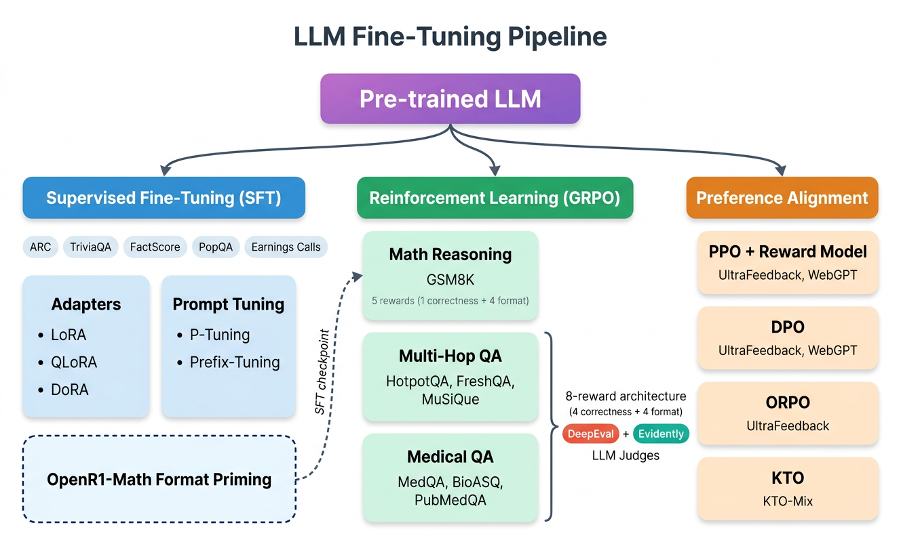

<h1 align="center">
    <a href="https://github.com/avnlp/llm-finetuning">LLM Fine-tuning</a>
</h1>

<div align="center">

[](https://deepwiki.com/avnlp/llm-finetuning)
[](https://github.com/avnlp/llm-finetuning/actions/workflows/ci.yml)
[](https://github.com/avnlp/llm-finetuning/actions/workflows/ci.yml)
[](https://github.com/avnlp/llm-finetuning/actions/workflows/ci.yml)
[](https://github.com/avnlp/llm-finetuning/actions/workflows/ci.yml)
[](https://github.com/avnlp/llm-finetuning/blob/main/LICENSE)

</div>

This repository provides implementations of large language model fine-tuning across three training paradigms: Supervised Fine-Tuning (SFT) with adapter methods, Reinforcement Learning with Group Relative Policy Optimization (GRPO), and Preference Alignment. It includes 39 training pipelines spanning 16 datasets across math reasoning, multi-hop question answering, medical question answering, and general question answering domains. Training is built on [HuggingFace TRL](https://huggingface.co/docs/trl), [PEFT](https://huggingface.co/docs/peft), and [Unsloth](https://github.com/unslothai/unsloth), with reward functions powered by [DeepEval](https://deepeval.com/) and [Evidently AI](https://www.evidentlyai.com/).

<p align="center">
  
</p>

## Supervised Fine-Tuning

Supervised Fine-Tuning uses adapter-based methods to efficiently fine-tune Llama-3.2-3B on five question answering datasets. All methods use `SFTTrainer` from TRL and preserve the frozen base model weights, training only the adapter parameters.

| Technique | Description | Key Parameter |
|-----------|-------------|---------------|
| **LoRA** | Low-rank weight updates applied to attention and feed-forward projection matrices | Rank 8, alpha 32 |
| **QLoRA** | LoRA with 4-bit NF4 quantization of the base model via BitsAndBytes | Rank 8, alpha 32 |
| **DoRA** | Weight-Decomposed LoRA - decomposes weights into magnitude and direction, applies LoRA to the directional component | `use_dora=True` |
| **P-Tuning** | Trains a small encoder network to produce continuous prompt embeddings prepended to the input | Virtual tokens configurable |
| **Prefix-Tuning** | Prepends trainable prefix vectors to the key and value tensors of every attention layer | Virtual tokens configurable |

**Datasets:**

| Dataset | Domain | Description |
|---------|--------|-------------|
| [ARC](https://huggingface.co/datasets/allenai/ai2_arc) | Science QA | AI2 Reasoning Challenge - grade-school multiple choice science questions |
| [TriviaQA](https://huggingface.co/datasets/mandarjoshi/trivia_qa) | Open-Domain QA | Trivia questions with evidence documents from Wikipedia and the web |
| [FactScore](https://huggingface.co/datasets/awinml/factscore_unlabelled_alpaca_13b_retrieval) | Factual QA | Atomic fact verification dataset for hallucination detection |
| [PopQA](https://huggingface.co/datasets/akariasai/PopQA) | Entity QA | Factoid questions about popular entities from Wikipedia |
| [Earnings Calls](https://huggingface.co/datasets/lamini/earnings-calls-qa) | Financial QA | Question answering over earnings call transcripts from 2800+ companies |

**Running a pipeline:**

```bash
python src/llm_finetuning/supervised_finetuning/lora/arc/train.py
python src/llm_finetuning/supervised_finetuning/qlora/triviaqa/train.py
python src/llm_finetuning/supervised_finetuning/dora/earnings_call/train.py
python src/llm_finetuning/supervised_finetuning/p_tuning/popqa/train.py
python src/llm_finetuning/supervised_finetuning/prefix_tuning/factscore/train.py
```

## Math Reasoning

### GRPO on GSM8K

Fine-tunes language models to generate step-by-step reasoning for math word problems using Group Relative Policy Optimization (GRPO). Five models are trained on [GSM8K](https://huggingface.co/datasets/openai/gsm8k) (7,473 grade-school math problems) with one correctness reward and four format rewards.

**Models:** Phi-4, Mistral-7B, Llama-3.2-3B, Llama-3.1-8B, Gemma3-1B

**Reward Functions:**

| Category | Reward Function | Description |
|----------|-----------------|-------------|
| Correctness | `AnswerCorrectnessReward` | Extracts the numeric value from `<answer>` tags and compares to ground truth |
| Format | `ReasoningTagsReward` | Validates presence and proper nesting of `<reasoning>` and `<answer>` tags |
| Format | `StepFormatReward` | Rewards numbered or bulleted step-by-step structure (minimum 3 steps) |
| Format | `MultilineComplianceReward` | Rewards multi-line responses with sufficient depth (minimum 5 lines) |
| Format | `ResponseStructureReward` | Validates that both reasoning and answer blocks are present |

**Running:**

```bash
python src/llm_finetuning/math_reasoning/grpo/gsm8k/train.py
```

### Two-Stage Pipeline (SFT + GRPO)

A two-stage training pipeline for Qwen-3 Base that first primes the model on structured reasoning format before applying GRPO:

- **Stage 1 - SFT** on [OpenR1-Math-220k](https://huggingface.co/datasets/open-r1/OpenR1-Math-220k): teaches the `<reasoning>/<answer>` format using numeric-answer examples filtered to a 1024-token budget
- **Stage 2 - GRPO** on GSM8K: reinforces correctness and format compliance using the same five reward functions

**Running:**

```bash
python src/llm_finetuning/math_reasoning/sft/openr1_math/train.py
python src/llm_finetuning/math_reasoning/grpo/gsm8k/train.py
```

## Multi-Hop Question Answering

Fine-tunes Llama-3.2-3B using QLoRA and GRPO on three multi-hop reasoning datasets. Eight reward functions enforce both answer quality and structured reasoning format.

**Datasets:**

| Dataset | Size | Description |
|---------|------|-------------|
| [HotpotQA](https://huggingface.co/datasets/hotpotqa/hotpot_qa) | 90,447 | Multi-hop questions requiring reasoning over two Wikipedia paragraphs |
| [FreshQA](https://huggingface.co/datasets/vtllms/sealqa) | 254 | Search-augmented QA benchmark for long-context, multi-document reasoning under noisy retrieval |
| [MuSiQue](https://huggingface.co/datasets/dgslibisey/MuSiQue) | 19,938 | Multi-hop questions with explicit supporting facts and compositional reasoning |

**Reward Functions:**

| Category | Reward Function | Description |
|----------|-----------------|-------------|
| Correctness | `DeepEvalGEvalRAGReward` | GEval metric with a custom LLM-as-a-Judge instruction tailored for RAG evaluation |
| Correctness | `DeepEvalSummarizationReward` | DeepEval Summarization metric measuring faithfulness to source context |
| Correctness | `DeepEvalAnswerRelevancyReward` | DeepEval Answer Relevancy metric measuring response relevance to the question |
| Correctness | `EvidentlyCorrectnessLLMReward` | Evidently AI CorrectnessLLMEval metric for answer accuracy scoring |
| Format | `ReasoningTagsReward` | Validates presence and proper nesting of `<reasoning>` and `<answer>` tags |
| Format | `MultilineComplianceReward` | Rewards multi-line structured responses |
| Format | `StructureValidationReward` | Validates overall response structure against expected schema |
| Format | `ResponseFormatReward` | Enforces consistent formatting conventions across the response |

**Running:**

```bash
python src/llm_finetuning/multi_hop_question_answering/grpo/hotpotqa/train.py
python src/llm_finetuning/multi_hop_question_answering/grpo/freshqa/train.py
python src/llm_finetuning/multi_hop_question_answering/grpo/musique/train.py
```

## Medical Question Answering

Fine-tunes Llama-3.2-3B using QLoRA and GRPO on three biomedical QA datasets. Uses the same eight reward function architecture as multi-hop QA, with LLM-as-a-Judge evaluation tailored for biomedical reasoning.

**Datasets:**

| Dataset | Size | Description |
|---------|------|-------------|
| [MedQA](https://huggingface.co/datasets/bigbio/med_qa) | 10,178 | USMLE-style multiple-choice medical questions |
| [BioASQ](https://huggingface.co/datasets/enelpol/rag-mini-bioasq) | 4,012 | Free-text biomedical questions from PubMed literature |
| [PubMedQA](https://huggingface.co/datasets/qiaojin/PubMedQA) | 211,269 | Research article question answering from PubMed abstracts |

**Running:**

```bash
python src/llm_finetuning/medical_question_answering/medqa/train.py
python src/llm_finetuning/medical_question_answering/bioasq/train.py
python src/llm_finetuning/medical_question_answering/pubmedqa/train.py
```

## Preference Alignment

Fine-tunes language models using human preference signals with four alignment algorithms. All methods use QLoRA (4-bit quantization) via Unsloth and TRL trainers.

### DPO - Direct Preference Optimization

Directly optimizes the model using `{prompt, chosen, rejected}` triplets without a separate reward model.

| Model | Dataset | Description |
|-------|---------|-------------|
| Zephyr-7B | [UltraFeedback](https://huggingface.co/datasets/HuggingFaceH4/ultrafeedback_binarized) (~60k) | General instruction following preference alignment |
| Llama-3-8B | [WebGPT Comparisons](https://huggingface.co/datasets/openai/webgpt_comparisons) (~19k) | Question answering preference alignment from WebGPT human comparisons |

```bash
python src/llm_finetuning/preference_alignment/dpo/ultrafeedback/train.py
python src/llm_finetuning/preference_alignment/dpo/webgpt/train.py
```

### ORPO - Odds Ratio Preference Optimization

Combines supervised fine-tuning and preference alignment in a single training step using an odds ratio penalty, removing the need for a reference model.

| Model | Dataset |
|-------|---------|
| Llama-3-8B | [UltraFeedback](https://huggingface.co/datasets/HuggingFaceH4/ultrafeedback_binarized) (~60k) |

```bash
python src/llm_finetuning/preference_alignment/orpo/ultrafeedback/train.py
```

### KTO - Kahneman-Tversky Optimization

Trains on binary desirability labels (`{prompt, completion, label}`) using prospect theory-inspired loss, without requiring paired preference data.

| Model | Dataset |
|-------|---------|
| Qwen2.5-1.5B | [KTO-Mix-14k](https://huggingface.co/datasets/trl-lib/kto-mix-14k) (14k) |

```bash
python src/llm_finetuning/preference_alignment/kto/kto_mix/train.py
```

### PPO - Proximal Policy Optimization

Uses a reward model to score rollouts during training, applying policy gradient updates with a KL penalty to prevent drift from the reference model. Uses [OpenAssistant DeBERTa-v3](https://huggingface.co/OpenAssistant/reward-model-deberta-v3-large-v2) as the pointwise reward model.

| Model | Dataset |
|-------|---------|
| Llama-3-8B | [UltraFeedback](https://huggingface.co/datasets/HuggingFaceH4/ultrafeedback_binarized) (~60k) |
| Llama-3-8B | [WebGPT Comparisons](https://huggingface.co/datasets/openai/webgpt_comparisons) (~19k) |

```bash
python src/llm_finetuning/preference_alignment/ppo/ultrafeedback/train.py
python src/llm_finetuning/preference_alignment/ppo/webgpt/train.py
```

## Installation

The project uses [uv](https://github.com/astral-sh/uv) for dependency management. First, ensure uv is installed:

```bash
pip install uv
```

Then install the project dependencies:

```bash
uv sync
source .venv/bin/activate
```

For development dependencies (linting, type checking):

```bash
uv sync --dev
source .venv/bin/activate
```

### Environment Setup

For GRPO pipelines using LLM-as-a-Judge reward functions, create a `.env` file with:

```env
OPENAI_API_KEY=your_openai_api_key
```

## Project Structure

```text
src/llm_finetuning/
├── core/                                    # Shared abstractions
│   ├── dataset_loader.py                    # BaseDatasetLoader, DatasetConfig
│   ├── prompt_template.py                   # PromptTemplate
│   ├── reward.py                            # BaseReward abstract class
│   └── llm_judges/                          # LLM-as-a-Judge reward implementations
│       ├── deepeval.py                      # DeepEval-backed rewards
│       └── evidently.py                     # Evidently-backed rewards
│
├── supervised_finetuning/                   # 25 SFT pipelines (5 techniques × 5 datasets)
│   ├── loaders.py                           # Dataset loaders for all 5 SFT datasets
│   ├── data_preparation/                    # Prompt templates per dataset
│   ├── lora/{arc,triviaqa,factscore,popqa,earnings_call}/
│   ├── qlora/{arc,triviaqa,factscore,popqa,earnings_call}/
│   ├── dora/{arc,triviaqa,factscore,popqa,earnings_call}/
│   ├── p_tuning/{arc,triviaqa,factscore,popqa,earnings_call}/
│   └── prefix_tuning/{arc,triviaqa,factscore,popqa,earnings_call}/
│
├── math_reasoning/                          # 2 pipelines
│   ├── sft/openr1_math/                     # Stage 1: Format-priming SFT
│   ├── grpo/gsm8k/                          # Stage 2: GRPO with reward functions
│   └── reward_functions/
│       ├── correctness/answer_correctness.py
│       └── format/{reasoning_tags,step_format,multiline_compliance,response_structure}.py
│
├── multi_hop_question_answering/            # 3 GRPO pipelines
│   ├── grpo/{hotpotqa,freshqa,musique}/
│   └── reward_functions/
│       ├── correctness/{deepeval_gevalrag,deepeval_summarization,deepeval_answer_relevancy,evidently_correctness_llm}.py
│       └── format/{reasoning_tags,multiline_compliance,structure_validation,response_format}.py
│
├── medical_question_answering/              # 3 GRPO pipelines
│   ├── {medqa,bioasq,pubmedqa}/
│   └── reward_functions/
│       ├── correctness/
│       └── format/
│
└── preference_alignment/                    # 6 pipelines
    ├── base_loader.py
    ├── reward_models/pointwise_reward_model.py
    ├── dpo/{ultrafeedback,webgpt}/
    ├── orpo/ultrafeedback/
    ├── kto/kto_mix/
    └── ppo/{ultrafeedback,webgpt}/
```

Each pipeline directory contains:

```text
<technique>/<dataset>/
├── train.py           # Training script
├── config.yaml        # Hyperparameters (model_id, learning_rate, LoRA rank, etc.)
└── data_processing.py # Dataset-specific loader and formatter
```

## Contributing

Please see the [CONTRIBUTING.md](CONTRIBUTING.md) file for detailed contribution guidelines.

## License

This project is licensed under the MIT License - see the [LICENSE](LICENSE) file for details.
